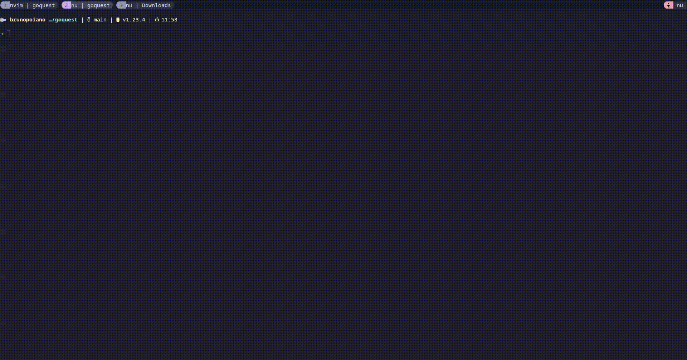

# GOquest

GOquest is a API Client tool for designing and testings REST, WebSockets and HTTP compatible protocols. Writen in [Go](https://golang.org/) and [Bubbletea](https://github.com/charmbracelet/bubbletea)

## Sending Requests

Quick way to send requests and visualize responses 

## Requests Table

All the requests send is stored on a database to facilitate tests 

## Add Curl

You can import a curl and it's automatically store on the database

