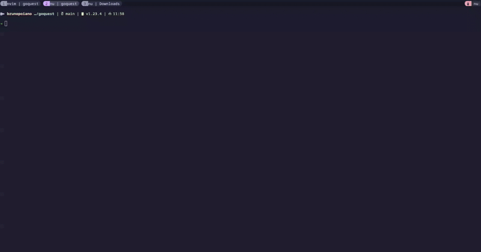

# GOquest

GOquest is a API Client tool for designing and testings REST, WebSockets and HTTP compatible protocols. Writen in [Go](https://golang.org/) and [Bubbletea](https://github.com/charmbracelet/bubbletea)


[demo.mp4](https://github.com/user-attachments/assets/fec18357-4ea3-4f2f-a7bd-0cb9e24f6ffb)

## Sending Requests

Quick way to send requests and visualize responses 


## Requests Table

All the requests send is stored on a database to facilitate tests 


## Add Curl

You can import a curl and it's automatically store on the database


## Install
### Binary
```bash
  git clone https://github.com/BrunoPoiano/goquest.git
  cd goquest
  ./goquest
```

### From source:
Clone the project

```bash
  git clone https://github.com/BrunoPoiano/goquest.git
```

cd to the directory

```bash
  cd goquest
```
Iniciate a new go module

```bash
  go mod init goquest
```

```bash
  go mod tidy
```

Compile packages and dependencies

```bash
  go build .
```

Start the project

```bash
  ./goquest
```


## Limitations

Unfortunatelly the huh.Text component only have 400 characters, which limits the fields Header and Body. You can bypass this limitation by importing a curl, but then it's not ideal when editing the field
