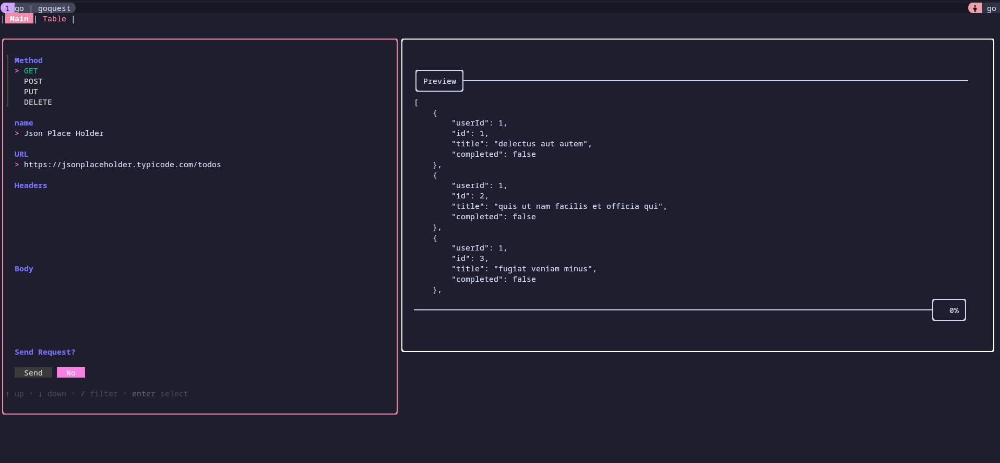
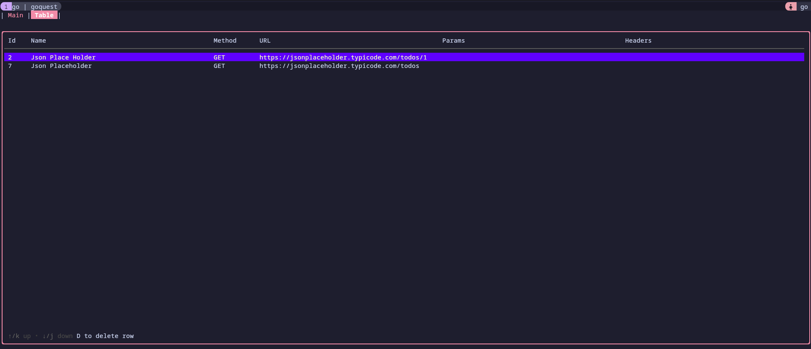

# GOquest

GOquest is a API Client tool for designing and testings REST, WebSockets and HTTP compatible protocols. Writen in [Go](https://golang.org/) and [Bubbletea](https://github.com/charmbracelet/bubbletea)

[demo.webm](https://github.com/user-attachments/assets/1c484e41-5e4e-44b7-a5d2-120a9d801aab)

## Sending Requests

Quick way to send requests and visualize responses 

## Requests Table

All the requests send is stored on a database to facilitate tests 

## Add Curl

You can import a curl and it's automatically store on the database
[curl.webm](https://github.com/user-attachments/assets/0c4b5ebd-c860-46c0-abf8-a14e39b93629)

